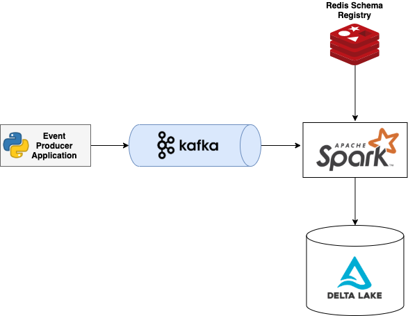

# Spark Streaming Delta Lake Reference Architecture

## **Overview**

The project demonstrates a reference architecture for a Spark Streaming application that writes data to Delta tables.

## **Spark Application**

**Environment Variables**

| Variable                |   Description |  Required | Default   |
|-------------------------|---------------|-----------|------------
| AWS_ACCESS_KEY          | AWS access key                        | Yes       | NA        |
| AWS_SECRET_KEY          | AWS secret access key                 | Yes       | NA        |
| REDIS_HOST              | Redis host                            | No        | localhost |
| REDIS_PORT              | Redis port                            | No        | 5555      |
| S3_BUCKET               | S3 bucket where data will be written  | Yes       | NA        |
| S3_PREFIX               | Prefix of data in S3                  | No        | data/     |
| KAFKA_BOOTSTRAP_SERVERS | Kafka boostrap server list | Yes      | NA        |
| KAFKA_TOPIC             | Kafka topic                           | Yes       | NA        |
